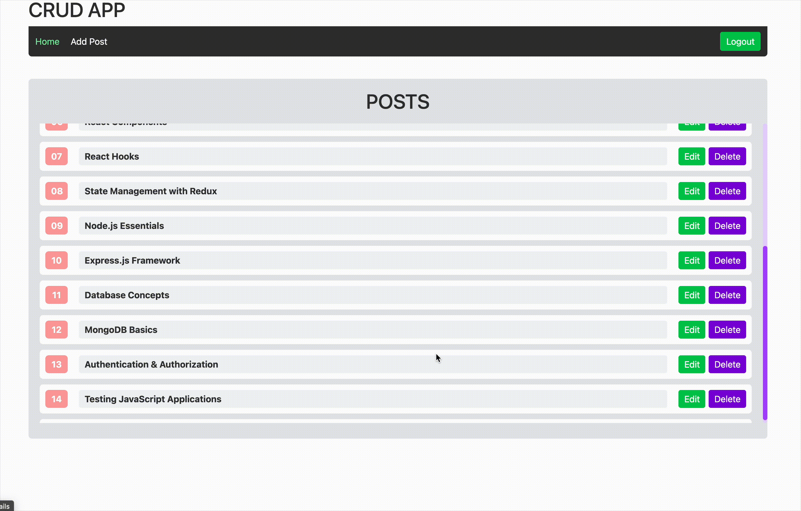

# ⚛️ React Redux Router v7 CRUD

A production-grade React application demonstrating the integration of **Redux Toolkit**, **React Router v7**, **React Hook Form**, and **Zod** in a fully Type-Safe environment.

[](https://app.netlify.com/projects/rtk-router-crud-app/deploys)
[](https://rtk-router-crud-app.netlify.app/)

<br />



> **⚠️ Important Note:** This project relies on a local simulated backend (`json-server`). The Live Demo on Netlify will show the UI, but data fetching/saving will fail unless you run the API locally.

---

## ✨ Key Features

- **🛡️ Type-Safety First:** Built with **TypeScript** to ensure robust and error-free code.
- **⚡ State Management:** **Redux Toolkit** with `createAsyncThunk` for managing API states (Loading, Success, Error).
- **🚦 Modern Routing:** Utilizing **React Router v7** with Data APIs, Layouts, and **Lazy Loading** for performance.
- **📝 Robust Forms:** **React Hook Form** integrated with **Zod** for schema-based validation.
- **🎨 Modern UI:**
  - Styled with **Tailwind CSS v4**.
  - Custom reusable components (`Button`, `InputField`) built with `clsx`.
  - Responsive Grid Layouts.
- **🔒 Security:** **Auth Guard** (Protected Routes) logic to restrict access to sensitive actions (Add/Edit/Delete).

---

## 🛠️ Tech Stack

| Category | Technology |
| :--- | :--- |
| **Core** | React 19, TypeScript, Vite |
| **State** | Redux Toolkit, React-Redux |
| **Routing** | React Router v7 (`createBrowserRouter`) |
| **Forms** | React Hook Form, Zod, Hookform Resolvers |
| **Styling** | Tailwind CSS v4, Clsx |
| **HTTP** | Axios |
| **Backend** | JSON Server (Mock API) |

---

## ⚙️ How to Run Locally

To experience the full functionality (Data Persistence), follow these steps:

1.  **Clone the repository:**
    ```bash
    git clone https://github.com/HossamGezo/rtk-router-crud-app.git
    cd rtk-router-crud-app
    ```

2.  **Install Dependencies:**
    ```bash
    npm install
    ```

3.  **Start the Project:**
    You need to run two terminals:

    **Terminal 1 (Backend / Fake API):**
    ```bash
    npm run start
    ```
    *(Server runs at http://localhost:3050)*

    **Terminal 2 (Frontend / React App):**
    ```bash
    npm run dev
    ```
    *(App runs at http://localhost:3030)*

4.  **Access the App:**
    Open `http://localhost:3030` in your browser.

---

## 📂 Project Architecture

We follow a scalable **Feature-Based** structure:

```text
src/
├── app/              # Store configuration & Typed Hooks
├── components/       # Reusable UI components (Button, Input, Header)
├── features/         # Redux Slices (Auth, Posts) & Thunks
├── layout/           # Main Layout & Wrappers
├── pages/            # Page Components (Home, Add, Edit, Details)
├── routes/           # Router Config, Lazy Loading & Guards
└── main.tsx          # App Entry Point
```

---

## 👨‍💻 Author

**Hossam**
- GitHub: [@HossamGezo](https://github.com/HossamGezo)